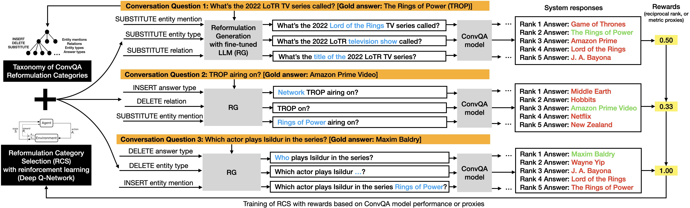

REIGN: Robust Training for Conversational Question Answering Models via Reinforced Reformulation Generation
============

Description
------------

This repository contains the code and data for our WSDM'24 full paper. Our method REIGN (REInforced GeNeration) aims to
to increase the robustness of ConvQA models. It strengthens the model's *training* by exposing it upfront to a larger variety of intent-preserving surface forms for the same training sample.
We proprose a reinforcement learning model based on Deep-Q networks that is used as a means for *model-specific data augmentation*: it learns to select only the top-*k* reformulations that would be used for additional training data for the QA model for maximum performance improvement.

<center></center>
*Example showing the main processing steps in REIGN: Predicting most suitable reformulation categories (defined by our reformulation taxonmoy) based on QA performance metrics and generating reformulations for predicted categories (RG).*

For more details see our paper: [Robust Training for Conversational Question Answering Models via Reinforced Reformulation Generation](https://arxiv.org/pdf/2310.13505.pdf) and visit our project website: https://reign.mpi-inf.mpg.de.

If you use this code, please cite:
```bibtex
@article{kaiser2023robust,
  title={Robust Training for Conversational Question Answering Models with Reinforced Reformulation Generation},
  author={Kaiser, Magdalena and Roy, Rishiraj Saha and Weikum, Gerhard},
  booktitle={WSDM},
  year={2024}
 }
```

Setup 
------

In our work, we conduct experiments on two ConvQA datasets, namely [ConvQuestions](https://convex.mpi-inf.mpg.de/) and [ConvMix](https://convinse.mpi-inf.mpg.de/) and showcase the effectiveness of the REIGN framework for two ConvQA models, namely [CONQUER](https://conquer.mpi-inf.mpg.de/) and [EXPLAIGNN](https://explaignn.mpi-inf.mpg.de/).

All code was tested on Linux with Python 3.8. 
<!--The relevant software and libraries include the following:

* Python 3.8

* Spacy 3.2.3

* Tagme 0.1.3

* Numpy 1.22.4

* Tensorflow 2.6.0

* Tensorflow Probability 0.14.1

* Pytorch 1.12.0

* Transformers 4.20.1

* TF-Agents 0.10.0

* Neo4j 4.3.7

* Scikit-learn 1.0.1-->

To install the required libraries, it is recommended to create a virtual environment:
```
   python3 -m venv REIGN_ENV 
   source REIGN_ENV/bin/activate
   pip install --upgrade pip
   pip install -r requirements.txt
```

Data
------

To initialize the repo (download data, benchmark, models and our main results), run:

```
bash initialize.sh
```

### Dependencies

For running experiments with EXLPAIGNN, the following steps are required:

1. Create a separate virtual environment for EXPLAIGNN:

```
cd EXPLAIGNN/
conda env create --file conda-explaignn.yml
conda activate explaignn
pip install -e .
```

2. EXPLAIGNN makes use of [CLOCQ](https://github.com/PhilippChr/CLOCQ) for retrieving relevant evidences.
CLOCQ can be conveniently integrated via the [publicly available API](https://clocq.mpi-inf.mpg.de), using the client from [the repo](https://github.com/PhilippChr/CLOCQ), it can be installed via:

```
bash make install_clocq
```

3. To initialize EXPLAIGNN, run (inside the EXPLAIGN directory):

```
bash scripts/initialize.sh 
bash scripts/reign_init.sh
```

We use [ELQ] (https://github.com/facebookresearch/BLINK.git) for entity linking. Clone the repo into the REIGN directory and download the required elq models via: 

```
git clone https://github.com/facebookresearch/BLINK.git
cd BLINK
chmod +x download_elq_models.sh
./download_elq_models.sh
```

Reformulation Generation (RG)
------

Our RG model is based on BART and is trained with distant supervision data; for training the model as well as producing reformulations for each of our 15 reformulation categories for each question in the respective dataset, run:

```
bash rg/BART/configs/BENCHMARK_refs.sh DATATYPE
```
where BENCHMARK is ``convmix`` or ``convquestions_seed`` and DATATYPE is ``train`` or ``dev``

Reformulation Category Selection (RCS)
------

The RCS model learns to select which reformulations to add for a respective QA model and for each question in the BENCHMARK; first, it collects rewards for how well the initial QA model can answer the respective reformulations, then these rewards are used in the RL training of the RCS model, and finally, the trained RCS model is used to decide which categories to use to augment the QA training data; these steps are performed by running the respective scripts:

```
bash rcs/configs/rcs_QAMODEL_BENCHMARK.sh
```

where QAMODEL is either ``conquer`` or ``explaignn`` and BENCHMARK is ``convmix`` or ``convquestions_seed``


Question Answering with augmented training data
------

In this repo, we provide some modified versions (for making evaluating/training with reformulations easier) of the original CONQUER and EXPLAIGNN code. 
The original code can be found here: CONQUER: https://github.com/magkai/CONQUER, EXPLAIGNN: https://github.com/PhilippChr/EXPLAIGNN.


### CONQUER

For training and evaluating CONQUER with reformulations, run:

```
bash qa/CONQUER/configs/BENCHMARK/reign_conquer.sh
```

For comparison with CONQUER without reformulations, run:

```
bash qa/CONQUER/configs/BENCHMARK/conquer.sh
```

where BENCHMARK is either ``convmix`` or ``convquestions``


### EXPLAIGNN

For training EXPLAIGNN with reformulations, go into qa/EXPLAIGNN and run (using the EXPLAIGNN virtual environment):

```
bash scripts/pipeline.sh --train configs/BENCHMARK/reign_explaignn.yml "kb"
```
where BENCHMARK is either ``convmix`` or ``convquestions``


For comparison with EXPLAIGNN without reformulations, run:

```
bash scripts/pipeline.sh --train configs/BENCHMARK/explaignn.yml "kb"
```

For evaluating on the GPT reformulations run: 

```
bash scripts/pipeline.sh --gpt-eval configs/BENCHMARK/reign_explaignn_gpt_eval.yml "kb"
```

